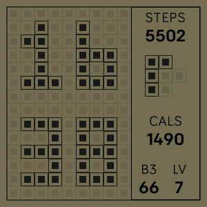

# Brick Face
Fitbit watch face inspired from the old Brick Game 
---
Stats shown include the following:
- **STEPS**: (user steps)
- Amount of **days that have passed in a week**:

||||||||
|:---:|:---:|:---:|:---:|:---:|:---:|:---:|
|Day One|Day Two|Day Three|Day Four|Day Five|Day Six|Day Seven

- **CALS**: (user calories)
- **B3**: (Battery/Charge level)
- **LV**: (elevation Gain)

# Screenshot

# Todo
- [ ] Allow clock-face to be clickable to toggle stats ie _distance, heart reading, etc_
- [ ] Show Distance walked
- [ ] Show heart rate reading
- [ ] Add analytics
- [ ] Add testing - unit tests
